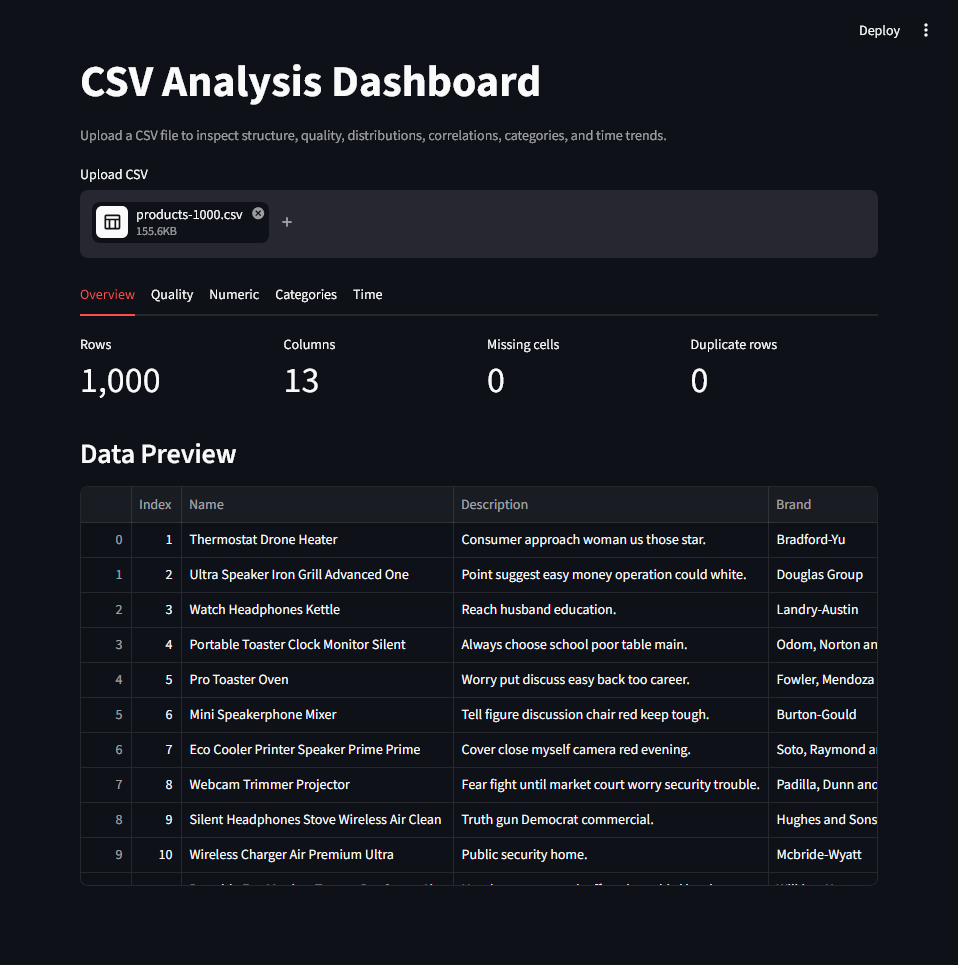
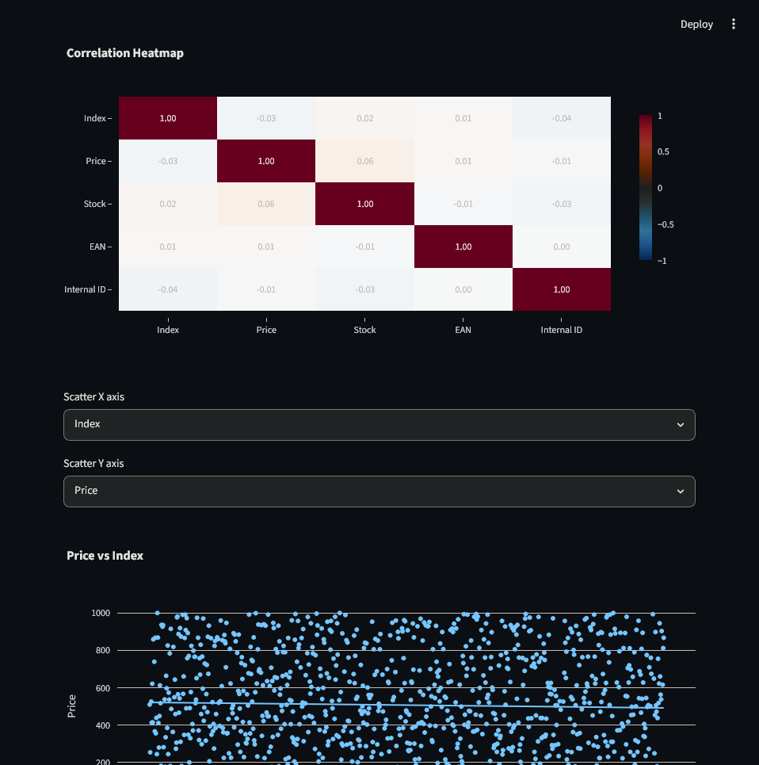
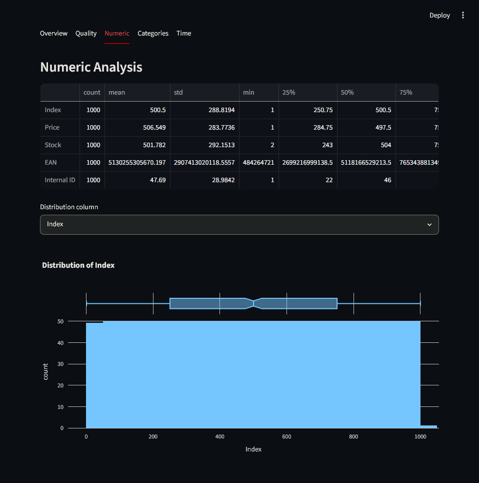
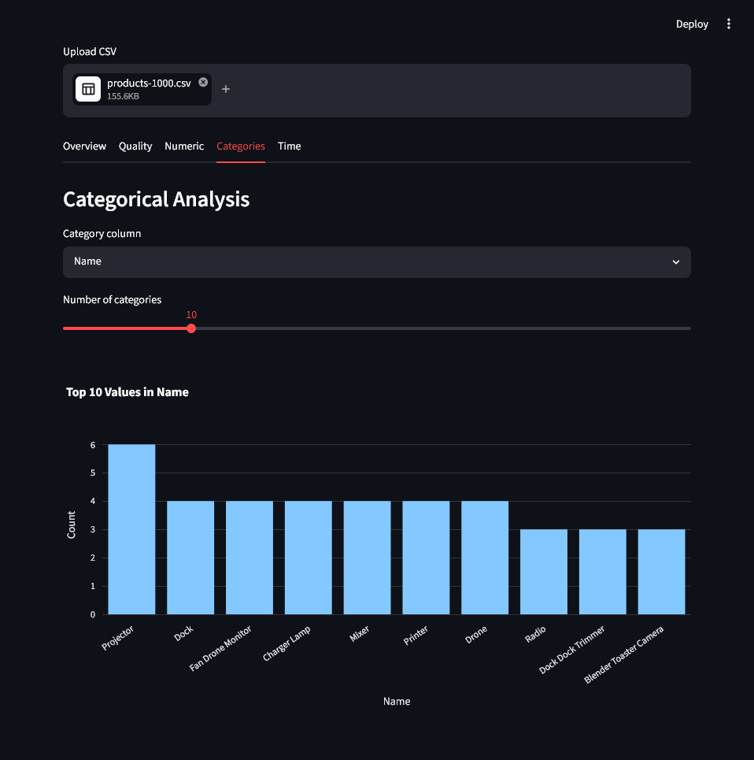

# CSV Analysis Dashboard

A Streamlit application for uploading a CSV file and quickly exploring the data through summary metrics, data quality checks, tables, and interactive diagrams.

## Demo Pictures
<table>
  <tr>
    <td></td>
    <td></td>
  </tr>
  <tr>
    <td></td>
    <td></td>
  </tr>
</table>

## What This App Does

The app lets you upload any `.csv` file and automatically builds a small analysis dashboard from it.

It includes:

- CSV upload from the browser
- Automatic fallback for common CSV encoding issues
- Data preview table
- Dataset overview metrics:
  - total rows
  - total columns
  - missing cells
  - duplicate rows
- Missing value report and chart
- Numeric column analysis:
  - descriptive statistics
  - histogram
  - box plot
  - correlation heatmap
  - scatter plot with trendline
- Categorical column analysis:
  - top category counts
  - bar chart for selected category column
- Date/time analysis:
  - automatic detection of date-like text columns
  - daily row count trend
  - daily average trend for selected numeric values

## Project Structure

```text
.
+-- app.py              # Main Streamlit application
+-- requirements.txt    # Python dependencies
+-- README.md           # Project documentation
```

## Requirements

Before starting, make sure you have:

- Python 3.10 or newer installed
- `pip` available
- A CSV file to analyze

You can check your Python version with:

```powershell
python --version
```

If `python` is not recognized, install Python from the official Python website and make sure the "Add Python to PATH" option is enabled during installation.

## Setup Guide

### 1. Open the Project Folder

Open a terminal in this project directory:

```powershell
cd PROJECT_PATH
```

### 2. Create a Virtual Environment

On Windows PowerShell:

```powershell
python -m venv .venv
```

On macOS or Linux:

```bash
python3 -m venv .venv
```

### 3. Activate the Virtual Environment

On Windows PowerShell:

```powershell
.\.venv\Scripts\Activate.ps1
```

If PowerShell blocks activation scripts, run this command once:

```powershell
Set-ExecutionPolicy -ExecutionPolicy RemoteSigned -Scope CurrentUser
```

Then activate the virtual environment again:

```powershell
.\.venv\Scripts\Activate.ps1
```

On Windows Command Prompt:

```cmd
.venv\Scripts\activate.bat
```

On macOS or Linux:

```bash
source .venv/bin/activate
```

After activation, your terminal should show `(.venv)` at the beginning of the prompt.

### 4. Install Dependencies

Install the required Python packages:

```powershell
pip install -r requirements.txt
```

The project uses:

- `streamlit` for the web application
- `pandas` for reading and analyzing CSV data
- `plotly` for interactive charts
- `statsmodels` for scatter plot trendlines

### 5. Start the App

Run the Streamlit application:

```powershell
streamlit run app.py
```

Streamlit will start a local development server and show a URL similar to:

```text
Local URL: http://localhost:8501
```

Open that URL in your browser.

## How to Use the App

1. Start the app with `streamlit run app.py`.
2. Open the local Streamlit URL in your browser.
3. Click the CSV upload box.
4. Select a `.csv` file from your computer.
5. Use the dashboard tabs to explore the data.

The available tabs are:

- `Overview`: high-level dataset metrics and first rows of data
- `Quality`: missing value table and missing value chart
- `Numeric`: statistics, distribution chart, correlation heatmap, and scatter plot
- `Categories`: top values for text, category, or boolean columns
- `Time`: trend charts for detected date/time columns

## Example Workflow

After uploading a CSV file, you can:

1. Check the `Overview` tab to confirm the file loaded correctly.
2. Open the `Quality` tab to find missing values.
3. Open the `Numeric` tab to inspect distributions and correlations.
4. Open the `Categories` tab to see the most common values in text columns.
5. Open the `Time` tab if your CSV contains date columns.

## CSV File Notes

The app expects a standard comma-separated CSV file.

For best results:

- Include a header row with column names.
- Use consistent date formats in date columns.
- Use numeric values without extra symbols when possible.
- Avoid merged cells or spreadsheet-only formatting.

If your file was exported from Excel or another spreadsheet tool, save or export it as `.csv` before uploading.

## Troubleshooting

### `streamlit` is not recognized

Make sure the virtual environment is activated and dependencies are installed:

```powershell
.\.venv\Scripts\Activate.ps1
pip install -r requirements.txt
```

Then run:

```powershell
streamlit run app.py
```

### `ModuleNotFoundError`

This means one or more dependencies are missing. Install them again:

```powershell
pip install -r requirements.txt
```

### PowerShell blocks virtual environment activation

Run:

```powershell
Set-ExecutionPolicy -ExecutionPolicy RemoteSigned -Scope CurrentUser
```

Then activate the environment:

```powershell
.\.venv\Scripts\Activate.ps1
```

### The uploaded CSV does not load

Check that:

- The file extension is `.csv`.
- The file is not empty.
- The file is not password-protected.
- The file uses a normal table format with rows and columns.

The app includes a fallback for common `latin-1` encoded files, but unusual encodings or malformed CSV files may still need to be cleaned before upload.

### The Time tab says no date/time columns were detected

The app tries to detect date-like text columns automatically. If no date columns appear:

- Check that your date values are consistent.
- Use common date formats such as `2026-06-04`, `06/04/2026`, or `2026/06/04`.
- Make sure the column contains mostly date values, not mixed text.

## Development Notes

The main app code is in `app.py`.

Important functions:

- `read_csv()` reads uploaded CSV files.
- `coerce_datetime_columns()` detects and converts date-like columns.
- `show_overview()` displays summary metrics and a preview.
- `show_data_quality()` displays missing value analysis.
- `show_numeric_analysis()` displays numeric statistics and diagrams.
- `show_categorical_analysis()` displays category frequency diagrams.
- `show_time_analysis()` displays time-based trend diagrams.

## Stopping the App

To stop the Streamlit server, return to the terminal where it is running and press:

```text
Ctrl + C
```